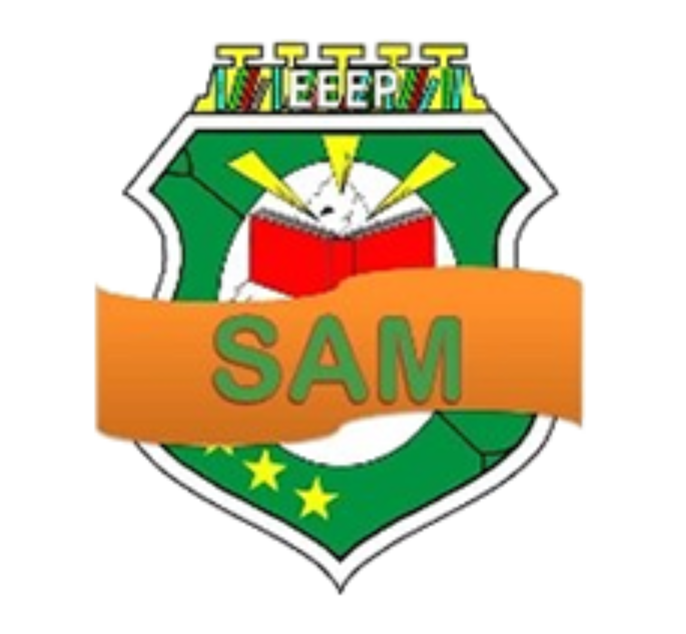

# SamWeb 🚀

**O navegador oficial da EEEP Salomão Alves de Moura.**

SamWeb é um navegador leve, moderno e temático, desenvolvido especificamente para atender às necessidades dos estudantes da instituição Salomão Alves de Moura. Com uma interface inspirada nos navegadores de alta performance (Chrome/Vivaldi), ele oferece uma experiência otimizada e focada no ambiente educacional.



## ✨ Principais Funcionalidades

- **Dashboard Integrada**: Acesso rápido a links importantes como Google Classroom, RedaSAM, Site da Escola e Achados e Perdidos.
- **Navegação Inteligente**: Barra de endereços multifuncional (Omnibox) que diferencia automaticamente URLs de termos de pesquisa.
- **Modo Escuro Dinâmico**: Sincronização automática entre o tema do sistema e o conteúdo web.
- **Leveza e Segurança**: Baseado no motor Chromium (via PyQt6), garantindo compatibilidade com sites modernos sem o consumo excessivo de memória.
- **Identidade Escolar**: Design e ícones personalizados com a identidade visual da EEEP Salomão Alves de Moura.

## 🛠️ Tecnologias Utilizadas

- **Linguagem**: Python 3.11+
- **Interface**: PyQt6 (QtWebEngine)
- **Persistência**: SQLite3
- **Estilização**: QSS (Qt Style Sheets) & TailwindCSS (Homepage)

## 📥 Como Usar

### Versão para Usuários (Executável)
Basta acessar a aba **[Releases](https://github.com/TioBrock/SamWeb/releases)** do projeto, baixar o arquivo `SamWeb.exe` e executá-lo. Não é necessário instalar o Python!

### Versão para Desenvolvedores (Código Fonte)
1. Instale o Python 3.11 ou superior.
2. Clone o repositório:
   ```bash
   git clone https://github.com/TioBrock/SamWeb.git
   ```
3. Instale as dependências:
   ```bash
   pip install -r requirements.txt
   ```
4. Execute o navegador:
   ```bash
   python main.py
   ```

---
